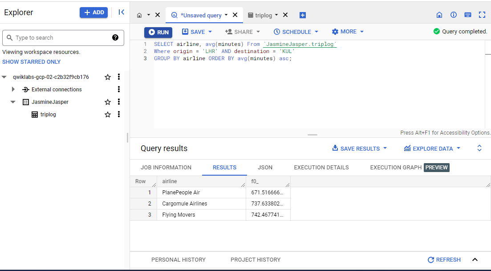

# Preparação para PDE: Fundamentos do BigQuery

Conhecimentos avaliados

- Criação de conjuntos de dados personalizados

- Importação de dados de um arquivo externo para uma tabela

- Definição de um esquema

- Uso do SQL para consultar dados

- Demonstração de conhecimento de agregadores e agrupamento em SQL

## Tarefa 1: crie um conjunto de dados personalizado
- [x] Crie um conjunto de dados personalizado no BigQuery chamado JasmineJasper.

- [x] Crie uma tabela chamada triplog no conjunto de dados.

- [x] Carregue os dados de origem na tabela.

- [x] O arquivo de registros está no formato CSV. Ele foi compartilhado com você em um bucket do Cloud Storage: cloud-training/preppde/2018-JasperJasmineMines.csv

Use o seguinte **esquema**:

date: integer,origin: string,destination: string,airline: string,miles: float,minutes: integer,duration: string

## Tarefa 2: consulte o conjunto de dados
No início de 2018, uma das companhias aéreas prometeu usar aviões novos e mais rápidos para todas as viagens que partiam do aeroporto de Heathrow, em Londres. Sua tarefa é criar duas consultas:

A primeira precisa verificar se todas as companhias aéreas têm voos com duração semelhante saindo de outro aeroporto.

A segunda consulta deve identificar se uma companhia aérea específica, a PlanePeople Air, cumpriu a promessa de usar aviões novos e mais rápidos para a Flowlogistic.

### Primeira consulta
Crie uma consulta que indique a duração média dos voos partindo do aeroporto de Frankfurt, Alemanha (FRA), com destino ao de Kuala Lumpur, Malásia (KUL). Agrupe os resultados por companhia aérea. As durações médias devem ser semelhantes.

### Segunda consulta
Crie uma consulta que indique a duração média dos voos partindo do aeroporto Heathrow de Londres, Reino Unido (LHR), com destino ao de Kuala Lumpur, Malásia (KUL). Agrupe os resultados por companhia aérea, ordenados do menor para o maior. As durações médias encontradas indicarão se a companhia aérea PlanePeople Air cumpriu a promessa de usar aviões mais rápidos no aeroporto de Heathrow.

## Solução

Já logado na GCP com o usuário e senha fornecido no lab, abrir o BigQuery.
 
1) Adicionar Dados no botão **+ ADD DATA** utilizando a fonte como **Google Cloud Storage**

2) Realizar a [Query 1](lab1-consulta1.sql)

3) Realizar a [Query 2](lab1-consulta2.sql)

