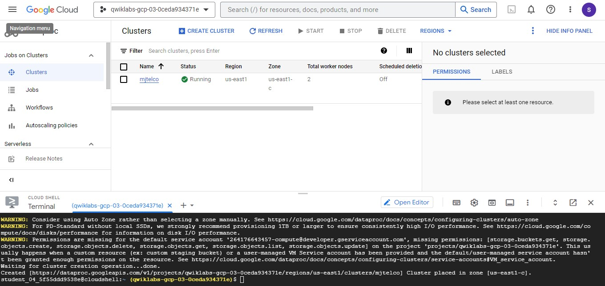
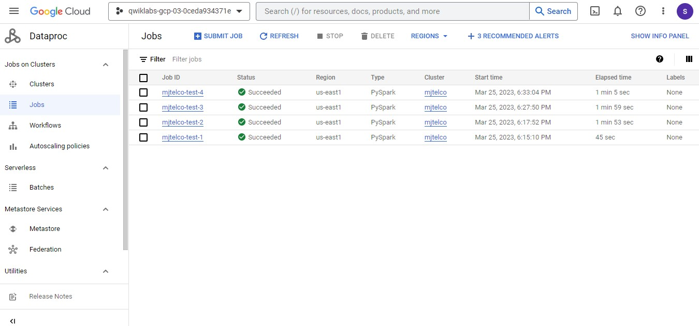

# Preparação para PDE: operação e manutenção de clusters do Cloud Dataproc

Conhecimentos avaliados:

- Criar um cluster com acesso a um bucket de preparação do Cloud Storage

- Executar jobs do PySpark com argumentos de entrada

- Fazer upgrade da configuração do nó mestre em um cluster existente

- Resolver um problema de desempenho de capacidade do cluster

- Fazer upgrade do número de nós de trabalho em um cluster

## Cenário do desafio
Agora você trabalha com engenharia de dados na empresa MJTelco. Parabéns pelo novo emprego!

A equipe de cientistas de dados da MJTelco pretende transferir um aplicativo de machine learning preditivo para um cluster do Cloud Dataproc. O aplicativo é escrito em Python e executado no Spark. O app leva muito tempo para ser executado, mesmo com dados de amostra. Por isso, os cientistas de dados criaram uma referência executando um programa no data center. Eles tentaram executar a referência em um cluster do Cloud Dataproc, mas está demorando mais do que o planejado. Sua tarefa é executar o programa de referência no Cloud Dataproc e fazer ajustes na configuração do cluster para atender aos requisitos dos cientistas.

Observação: o programa de referência é um aplicativo PySpark. Ele calcula o valor de PI. O valor de entrada determina quantas iterações são usadas no cálculo.

## Requisitos
Se o programa de referência receber um valor de entrada 220, e caso o job seja concluído em menos de 75 segundos, os requisitos serão atendidos.

Assim, quando o programa de referência for enviado com o valor de entrada 20, o job será concluído em menos de 75 segundos. Quando ele é enviado com o valor de entrada 220 obrigatório, o job leva cerca de 2 minutos para ser executado, o que não atende ao requisito.

### Tarefa 1: prepare o aplicativo PySpark de referência

Crie um bucket do Cloud Storage para seu cluster do Cloud Dataproc. Dê ao bucket o mesmo nome do projeto. Copie o aplicativo Python Spark de referência para o bucket do projeto.

O aplicativo foi compartilhado com você em um bucket do Cloud Storage: gs://cloud-training/preppde/benchmark.py

### Tarefa 2: crie um cluster do Cloud Dataproc com as mesmas configurações usadas pelo analista de dados
Os cientistas de dados estão usando um cluster mínimo do Cloud Dataproc que consiste em um nó mestre e dois nós de trabalho. Todas as instâncias são do tipo n1-standard-2.

Crie um cluster do Cloud Dataproc chamado mjtelco usando a versão 2.0 (Debian 10, Hadoop 3.2, Spark 3.1) com um nó mestre n1-standard-2 e dois nós de trabalho n1-standard-2 na região us-central1 e na zona us-central1-a. Nas outras configurações, use o padrão.

### Tarefa 3: demonstre o job de referência executado corretamente sem o valor de entrada obrigatório
Envie o job em Python ao cluster e dê a ele o nome mjtelco-test-1. Defina o argumento de entrada do job com o valor 20. Em Máximo de reinicializações por hora, digite 1.

O job deve levar menos de 75 segundos para ser executado com sucesso.

### Tarefa 3: demonstre o job de referência executado corretamente sem o valor de entrada obrigatório
Envie o job em Python ao cluster e dê a ele o nome mjtelco-test-1. Defina o argumento de entrada do job com o valor 20. Em Máximo de reinicializações por hora, digite 1.

O job deve levar menos de 75 segundos para ser executado com sucesso.

### Tarefa 5: faça upgrade do nó mestre

Sua segunda tarefa é melhorar o desempenho do cluster e reduzir o tempo necessário para executar o job de referência.

Atualize o nó mestre para uma instância de quatro CPUs, n1-standard-4.

### Tarefa 6: demonstre que o job de referência é concluído em menos tempo
Quando o nó mestre atualizado estiver em execução, envie o job em Python novamente ao cluster. Dê ao job o nome de mjtelco-test-3. Defina o argumento de entrada do job com o valor 220. Em Máximo de reinicializações por hora, digite 1.

O job deve levar cerca de 2 minutos para ser executado com sucesso.

### Tarefa 7: amplie o cluster
Você está chegando perto, mas o job ainda não está sendo concluído dentro do tempo necessário (menos de 75 segundos) quando recebe o valor de entrada 220.

Adicione mais três nós de trabalho n1-standard-2 para fazer upgrade do cluster para um total de cinco nós de trabalho.

### Tarefa 8: envie o job e verifique se o desempenho está melhor
Quando os nós adicionais estiverem em execução, envie o job novamente. Envie o job Python ao cluster e dê a ele o nome mjtelco-test-4. Defina o argumento de entrada do job com o valor 220. Em Máximo de reinicializações por hora, digite 1.

O job de referência será concluído no tempo necessário (menos de 75 segundos).

## Solução:
Como fiz o LAB passado interamente no console, vou fazer algumas partes desses usando CLI no próprio CloudShell.

### Tarefa 1:

Criação do bucket:

OU 

Usando o Cloud Shell:

`gcloud storage buckets create gs://qwiklabs-gcp-03-0ceda934371e`

Copiar o arquivo para o bucket criado:

`gsutil cp gs://cloud-training/preppde/benchmark.py gs://qwiklabs-gcp-03-0ceda934371e/`

### Tarefa 2:

(Apesar da descrição, o sistema de correção do GCP pede para criar na região 'us-east1')

No **Dataproc** > Create cluster > On Compute Engine

Cluster name: mjtelco
region: us-east1 (**REGIÃO CORRETA**)
Zone: us-east-c (default)

**configure nodes**
MANAGER NODE

Series: N1
Machine Type: n1-standard-2

WORKERS NODE

Series: N1
Machine Type: n1-standard-2

**Customise Cluster**

Storage Staggin bucket: qwiklabs-gcp-03-0ceda934371e

OR EQUIVALENT COMMAND LINE:

`gcloud dataproc clusters create mjtelco --bucket qwiklabs-gcp-03-0ceda934371e --region us-east1 --zone us-east1-c --master-machine-type n1-standard-2 --master-boot-disk-size 500 --num-workers 2 --worker-machine-type n1-standard-2 --worker-boot-disk-size 500 --image-version 2.0-debian10 --project qwiklabs-gcp-03-0ceda934371e`

Cluster Criado:

### Tarefa 3:

Entrar no Cluster **mjtelco** e **(+) Submit job** com os parâmetros indicados:

Job ID: mjtelco-test-1

Job Type: PySpark

Main Python File: gs://qwiklabs-gcp-03-0ceda934371e/benchmark.py

Arguments: 20

Max Restart Per hour: 1

**SUBMIT** 

### Tarefa 4:
**(+) Submit job** com os parâmetros:

Job ID: mjtelco-test-2

Job Type: PySpark

Main Python File: gs://qwiklabs-gcp-03-0ceda934371e/benchmark.py

Arguments: 220

Max Restart Per hour: 1

### Tarefa 5:
Upgrade do Cluster:

gcloud dataproc clusters delete mjtelco --region=us-east1

Recriar com o Master Node com 4 CPUs:

`gcloud dataproc clusters create mjtelco --bucket qwiklabs-gcp-03-0ceda934371e --region us-east1 --zone us-east1-c --master-machine-type n1-standard-4 --master-boot-disk-size 500 --num-workers 2 --worker-machine-type n1-standard-2 --worker-boot-disk-size 500 --image-version 2.0-debian10 --project qwiklabs-gcp-03-0ceda934371e`

## Tarefa 6:

Job ID: mjtelco-test-3

Job Type: PySpark

Main Python File: gs://qwiklabs-gcp-03-0ceda934371e/benchmark.py

Arguments: 220

Max Restart Per hour: 1

mjtelco-test-3

### Tarefa 7: 

Ampliar o número de Workers Node para 5

gcloud dataproc clusters update mjtelco --region=us-east1 --num-workers=5

### Tarefa 8:

Job ID: mjtelco-test-4

Job Type: PySpark

Main Python File: gs://qwiklabs-gcp-03-0ceda934371e/benchmark.py

Arguments: 220

Max Restart Per hour: 1

## Observações finais

Laboratório concluído, mas o teste 3, apesar de usar um mananger node mais potente ainda demorou um pouco mais do que o teste 2. Por outro lado o teste 4 teve o tempo significativamente reduzido, atendendo ao requisito proposto.

